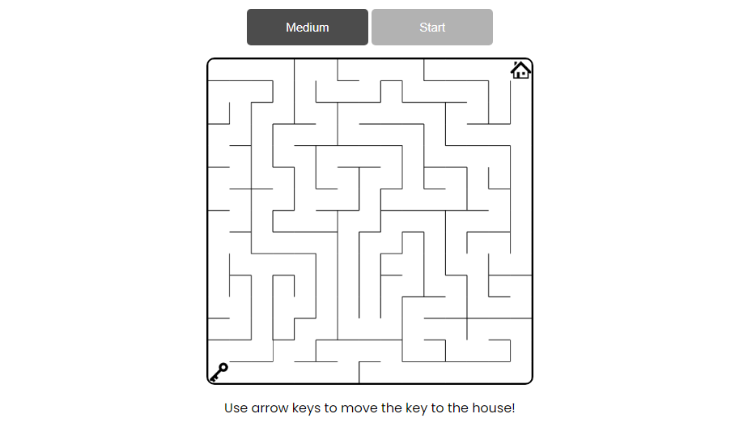

Here are the key features and logic of the Maze game:

Levels: The Maze Game consists of three levels Easy, Medium and Hard. Player can choose any Level as per his/her choice and play the game.

Start Position: The game begins with you placed at the starting position within the maze.

Key: The player controls Key, that moves through the maze. 

Movement: Use the arrow keys (up, down, left, right) to navigate through the maze. You can only move in the four cardinal directions (north, south, east, west).

Walls: Beware of walls! They are represented by solid blocks and act as obstacles. You cannot pass through walls, so you will need to find alternate routes.

Ending Position: Your goal is to reach the ending position marked within the maze. Once you reach it, you have successfully completed the maze.

removed untract files

